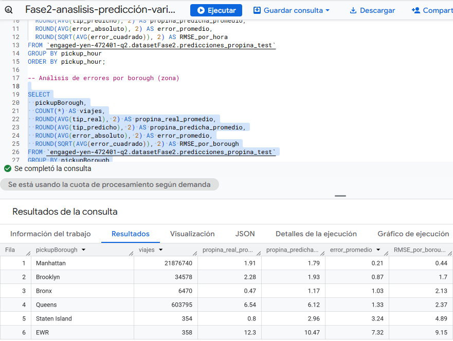
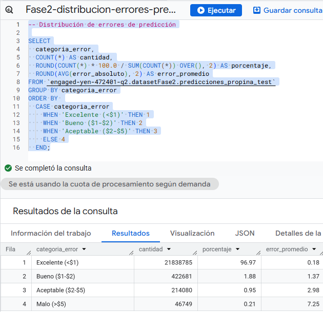

# Proyecto Fase 2

    * Douglas Darío Rivera Ojeda
    * 201122881
    * Sharon Estefany Tagual Godoy
    * 201906173

## Descripción general del problema

Las organizaciones modernas no solo buscan entender qué ocurrió en el pasado, sino anticiparse a lo que ocurrirá en el futuro. En este proyecto, los estudiantes deberán aplicar técnicas de aprendizaje automático para construir modelos que predigan variables clave del negocio de transporte urbano.
Se deberá seleccionar un caso de predicción relevante a partir del dataset (ej. monto de propina, duración de viaje, probabilidad de que exista propina). A partir de esa selección, los equipos tendrán que entrenar al menos dos modelos diferentes en BigQuery ML, comparar sus métricas de desempeño y justificar cuál se adapta mejor al problema planteado.
Finalmente, los resultados deberán presentarse en un tablero visual que permita observar de forma clara la relación entre valores reales y predichos, demostrando la aplicabilidad práctica del modelo en contextos de análisis de negocio.

## Dataset utilizado:

    * bigquery-public-data.new_york_taxi_trips.tlc_yellow_trips_2022.


Se utilizó el dataset público bigquery-public-data.new_york_taxi_trips.tlc_yellow_trips_2022, el cual contiene los registros de viajes realizados en taxis amarillos en Nueva York durante el año 2022. Incluye información sobre fechas y horas de inicio y fin del viaje, ubicaciones de recogida y destino, distancia, tipo de pago, montos de tarifa y propinas, lo que permite realizar análisis de movilidad, demanda y comportamiento de los usuarios.


## Tabla utilizada:

### Tabla temporal sin nulos

```sql
    CREATE OR REPLACE TABLE engaged-yen-472401-q2.datasetFase1.taxi_trips_temp AS
    SELECT 
    t.*,
    p.zone_name AS pickupZone,
    p.borough AS pickupBorough,
    p.zone_geom AS pickupGeom,
    d.zone_name AS dropoffZone,
    d.borough AS dropoffBorough,
    d.zone_geom AS dropoffGeom
    FROM `bigquery-public-data.new_york_taxi_trips.tlc_yellow_trips_2022` AS t
    LEFT JOIN `bigquery-public-data.new_york_taxi_trips.taxi_zone_geom` AS p
    ON CAST(t.pickup_location_id AS INT64) = CAST(p.zone_id AS INT64)
    LEFT JOIN `bigquery-public-data.new_york_taxi_trips.taxi_zone_geom` AS d
    ON CAST(t.dropoff_location_id AS INT64) = CAST(d.zone_id AS INT64)
    WHERE 
    pickup_datetime IS NOT NULL
    AND dropoff_datetime IS NOT NULL
    AND fare_amount IS NOT NULL
    AND total_amount IS NOT NULL
    AND passenger_count IS NOT NULL
    AND trip_distance IS NOT NULL
    AND pickup_location_id IS NOT NULL
    AND dropoff_location_id IS NOT NULL
    ORDER BY pickup_datetime;
```

### Crear tabla particionada y clusterizada

```sql
    CREATE OR REPLACE TABLE engaged-yen-472401-q2.datasetFase1.taxi_trips_partition_cluster
    PARTITION BY RANGE_BUCKET(data_file_month, GENERATE_ARRAY(1,12))
    CLUSTER BY pickup_location_id, dropoff_location_id 
    AS
    SELECT *
    FROM engaged-yen-472401-q2.datasetFase1.taxi_trips_temp;
```

### Crear tabla de entrenamiento y prueba

```sql

CREATE OR REPLACE TABLE `engaged-yen-472401-q2.datasetFase2.train_test_data` AS
SELECT
  -- Variable objetivo (a predecir)
  tip_amount,
  
  -- Features numéricas
  fare_amount,
  total_amount,
  trip_distance,
  passenger_count,
  
  -- Features temporales (ingeniería de características)
  EXTRACT(HOUR FROM pickup_datetime) AS pickup_hour,
  EXTRACT(DAYOFWEEK FROM pickup_datetime) AS pickup_dayofweek,
  data_file_month,
  
  -- Features categóricas
  pickupBorough,
  dropoffBorough,
  payment_type,
  
  -- División train/test: TRUE = entrenamiento (80%), FALSE = prueba (20%)
  RAND() < 0.8 AS split
  
FROM `engaged-yen-472401-q2.datasetFase1.taxi_trips_partition_cluster`
WHERE
  -- Filtros de calidad de datos (evitar datos inválidos)
  tip_amount >= 0                    -- Propinas no pueden ser negativas
  AND fare_amount > 0                -- Tarifa debe ser positiva
  AND total_amount > 0               -- Total debe ser positivo
  AND trip_distance > 0              -- Distancia debe ser positiva
  AND passenger_count BETWEEN 1 AND 6  -- Rango válido de pasajeros
  AND pickupBorough IS NOT NULL      -- Debe tener origen
  AND dropoffBorough IS NOT NULL     -- Debe tener destino
  AND payment_type IS NOT NULL       -- Debe tener método de pago
  AND tip_amount <= fare_amount * 2; -- Propina no mayor a 2x la tarifa (outliers)

```


### Creación de modelos

* Modelo 1
Modelo de Regresión Lineal básica

```sql
-- MODELO 1: Crear modelo de Regresión Lineal básica
-- Este es el modelo más simple, servirá como baseline

CREATE OR REPLACE MODEL `engaged-yen-472401-q2.datasetFase2.model_linear_reg_tip`
OPTIONS(
  model_type = 'linear_reg',              -- Tipo: Regresión Lineal
  input_label_cols = ['tip_amount'],      -- Variable a predecir
  data_split_col = 'split',               -- Columna para dividir train/test
  data_split_method = 'CUSTOM'            -- Usar nuestra división personalizada
) AS
SELECT * 
FROM `engaged-yen-472401-q2.datasetFase2.train_test_data`;
```


* Modelo 2
Modelo de Regresión Lineal con regularización L2

```sql
-- MODELO 2: Crear modelo de Regresión Lineal con regularización L2
-- L2_REG = 0.1 ayuda a prevenir overfitting

CREATE OR REPLACE MODEL `engaged-yen-472401-q2.datasetFase2.model_linear_reg_l2_tip`
OPTIONS(
  model_type = 'linear_reg',
  input_label_cols = ['tip_amount'],
  data_split_col = 'split',
  data_split_method = 'CUSTOM',
  l2_reg = 0.1                            -- Regularización L2 (Ridge)
) AS
SELECT * 
FROM `engaged-yen-472401-q2.datasetFase2.train_test_data`;
```


* Modelo 3
Modelo Boosted Tree básico

```sql
-- MODELO 3: Crear modelo Boosted Tree básico
-- Este modelo puede capturar patrones no lineales

CREATE OR REPLACE MODEL `engaged-yen-472401-q2.datasetFase2.model_boosted_tip`
OPTIONS(
  model_type = 'boosted_tree_regressor',  -- Árbol potenciado para regresión
  input_label_cols = ['tip_amount'],
  data_split_col = 'split',
  data_split_method = 'CUSTOM',
  max_iterations = 20                     -- Número de árboles a construir
) AS
SELECT * 
FROM `engaged-yen-472401-q2.datasetFase2.train_test_data`;
```


* Modelo 4
Modelo Boosted Tree optimizado

```sql

-- MODELO 4: Crear modelo Boosted Tree optimizado
-- Este modelo tiene hiperparámetros ajustados para mejor desempeño

CREATE OR REPLACE MODEL `engaged-yen-472401-q2.datasetFase2.model_boosted_optimized_tip`
OPTIONS(
  model_type = 'boosted_tree_regressor',
  input_label_cols = ['tip_amount'],
  data_split_col = 'split',
  data_split_method = 'CUSTOM',
  max_iterations = 50,                    -- Más iteraciones
  learn_rate = 0.1,                       -- Tasa de aprendizaje
  max_tree_depth = 8,                     -- Profundidad de árboles
  subsample = 0.8,                        -- Submuestreo
  min_tree_child_weight = 5               -- Peso mínimo por hoja
) AS
SELECT * 
FROM `engaged-yen-472401-q2.datasetFase2.train_test_data`;
```


### Información de entrenamiento (ML.TRAINING_INFO)

Acá obtenemos la información de el entranamiento de todos los modelos:

```sql

--  OBTENER INFORMACIÓN DE ENTRENAMIENTO (ML.TRAINING_INFO)
-- Ver información de entrenamiento de todos los modelos
-- Esto muestra cómo el modelo mejoró en cada iteración

SELECT
  'model_linear_reg_tip' AS modelo,
  iteration,
  loss AS training_loss,
  eval_loss AS validation_loss,
  learning_rate,
  duration_ms / 1000 AS duration_seconds
FROM ML.TRAINING_INFO(MODEL `engaged-yen-472401-q2.datasetFase2.model_linear_reg_tip`)
ORDER BY modelo, iteration;

SELECT
  'model_linear_reg_l2_tip' AS modelo, 
  iteration,
  loss,
  eval_loss,
  learning_rate,
  duration_ms / 1000
FROM ML.TRAINING_INFO(MODEL `engaged-yen-472401-q2.datasetFase2.model_linear_reg_l2_tip`)
ORDER BY modelo, iteration;

SELECT
  'model_boosted_tip' AS modelo,
  iteration,
  loss,
  eval_loss,
  learning_rate,
  duration_ms / 1000
FROM ML.TRAINING_INFO(MODEL `engaged-yen-472401-q2.datasetFase2.model_boosted_tip`)
ORDER BY modelo, iteration;


SELECT
  'model_boosted_optimized_tip' AS modelo,
  iteration,
  loss,
  eval_loss,
  learning_rate,
  duration_ms / 1000
FROM ML.TRAINING_INFO(MODEL `engaged-yen-472401-q2.datasetFase2.model_boosted_optimized_tip`)
ORDER BY modelo, iteration;

-- todos los modelos

SELECT
  'model_linear_reg_tip' AS modelo,
  iteration,
  loss AS training_loss,
  eval_loss AS validation_loss,
  learning_rate,
  duration_ms / 1000 AS duration_seconds
FROM ML.TRAINING_INFO(MODEL `engaged-yen-472401-q2.datasetFase2.model_linear_reg_tip`)

UNION ALL

SELECT
  'model_linear_reg_l2_tip',
  iteration,
  loss,
  eval_loss,
  learning_rate,
  duration_ms / 1000
FROM ML.TRAINING_INFO(MODEL `engaged-yen-472401-q2.datasetFase2.model_linear_reg_l2_tip`)

UNION ALL

SELECT
  'model_boosted_tip',
  iteration,
  loss,
  eval_loss,
  learning_rate,
  duration_ms / 1000
FROM ML.TRAINING_INFO(MODEL `engaged-yen-472401-q2.datasetFase2.model_boosted_tip`)

UNION ALL

SELECT
  'model_boosted_optimized_tip',
  iteration,
  loss,
  eval_loss,
  learning_rate,
  duration_ms / 1000
FROM ML.TRAINING_INFO(MODEL `engaged-yen-472401-q2.datasetFase2.model_boosted_optimized_tip`)

ORDER BY modelo, iteration;
```
Modelo 1
Modelo de Regresión Lineal básica


Modelo 2
Modelo de Regresión Lineal con regularización L2


Modelo 3
Modelo Boosted Tree básico


Modelo 4
Modelo Boosted Tree optimizado


Todos los modelos


### Evaluación de los modelos (ML.EVALUATE)

Evaluación y comparación de los modelos

```sql

-- Evaluar y comparar todos los modelos
-- Esta es la tabla MÁS IMPORTANTE para decidir cuál modelo es mejor

SELECT
  'model_linear_reg_tip' AS modelo,
  ROUND(mean_absolute_error, 4) AS MAE,
  ROUND(mean_squared_error, 4) AS MSE,
  ROUND(SQRT(mean_squared_error), 4) AS RMSE,
  ROUND(r2_score, 4) AS R2,
  ROUND(explained_variance, 4) AS explained_variance
FROM ML.EVALUATE(MODEL `engaged-yen-472401-q2.datasetFase2.model_linear_reg_tip`)
ORDER BY RMSE ASC;

SELECT
  'model_linear_reg_l2_tip',
  ROUND(mean_absolute_error, 4),
  ROUND(mean_squared_error, 4),
  ROUND(SQRT(mean_squared_error), 4) RMSE,
  ROUND(r2_score, 4),
  ROUND(explained_variance, 4)
FROM ML.EVALUATE(MODEL `engaged-yen-472401-q2.datasetFase2.model_linear_reg_l2_tip`)
ORDER BY RMSE ASC;

SELECT
  'model_boosted_tip',
  ROUND(mean_absolute_error, 4),
  ROUND(mean_squared_error, 4),
  ROUND(SQRT(mean_squared_error), 4) RMSE,
  ROUND(r2_score, 4),
  ROUND(explained_variance, 4)
FROM ML.EVALUATE(MODEL `engaged-yen-472401-q2.datasetFase2.model_boosted_tip`)
ORDER BY RMSE ASC;

SELECT
  'model_boosted_optimized_tip',
  ROUND(mean_absolute_error, 4),
  ROUND(mean_squared_error, 4),
  ROUND(SQRT(mean_squared_error), 4) RMSE,
  ROUND(r2_score, 4),
  ROUND(explained_variance, 4)
FROM ML.EVALUATE(MODEL `engaged-yen-472401-q2.datasetFase2.model_boosted_optimized_tip`)
ORDER BY RMSE ASC; 

 -- Ordenado por RMSE (menor = mejor)


-- ahora todos los modelos

SELECT
  'model_linear_reg_tip' AS modelo,
  ROUND(mean_absolute_error, 4) AS MAE,
  ROUND(mean_squared_error, 4) AS MSE,
  ROUND(SQRT(mean_squared_error), 4) AS RMSE,
  ROUND(r2_score, 4) AS R2,
  ROUND(explained_variance, 4) AS explained_variance
FROM ML.EVALUATE(MODEL `engaged-yen-472401-q2.datasetFase2.model_linear_reg_tip`)

UNION ALL

SELECT
  'model_linear_reg_l2_tip',
  ROUND(mean_absolute_error, 4),
  ROUND(mean_squared_error, 4),
  ROUND(SQRT(mean_squared_error), 4),
  ROUND(r2_score, 4),
  ROUND(explained_variance, 4)
FROM ML.EVALUATE(MODEL `engaged-yen-472401-q2.datasetFase2.model_linear_reg_l2_tip`)

UNION ALL

SELECT
  'model_boosted_tip',
  ROUND(mean_absolute_error, 4),
  ROUND(mean_squared_error, 4),
  ROUND(SQRT(mean_squared_error), 4),
  ROUND(r2_score, 4),
  ROUND(explained_variance, 4)
FROM ML.EVALUATE(MODEL `engaged-yen-472401-q2.datasetFase2.model_boosted_tip`)

UNION ALL

SELECT
  'model_boosted_optimized_tip',
  ROUND(mean_absolute_error, 4),
  ROUND(mean_squared_error, 4),
  ROUND(SQRT(mean_squared_error), 4),
  ROUND(r2_score, 4),
  ROUND(explained_variance, 4)
FROM ML.EVALUATE(MODEL `engaged-yen-472401-q2.datasetFase2.model_boosted_optimized_tip`)

ORDER BY RMSE ASC;
```
Modelo 1
Modelo de Regresión Lineal básica


Modelo 2
Modelo de Regresión Lineal con regularización L2


Modelo 3
Modelo Boosted Tree básico


Modelo 4
Modelo Boosted Tree optimizado


Todos los modelos


###  Generar predicciones (ML.PREDICT) - solo datos test

Usaremos "model_boosted_optimized_tip" para predecir propinas en datos de prueba ya que tubo menos RMSE

```sql

-- Generar predicciones con el mejor modelo
-- Esta tabla se usará para el dashboard de Looker Studio
-- mejor modelo 'model_boosted_optimized_tip'

CREATE OR REPLACE TABLE `engaged-yen-472401-q2.datasetFase2.predicciones_propina_test` AS
SELECT
  -- Valores reales del dataset de prueba
  actual.tip_amount AS tip_real,
  actual.fare_amount,
  actual.total_amount,
  actual.trip_distance,
  actual.passenger_count,
  actual.pickup_hour,
  actual.pickup_dayofweek,
  actual.pickupBorough,
  actual.dropoffBorough,
  actual.payment_type,
  
  -- Predicción del modelo
  predicted_tip_amount AS tip_predicho,
  
  -- Métricas de error individuales
  ABS(actual.tip_amount - predicted_tip_amount) AS error_absoluto,
  POWER(actual.tip_amount - predicted_tip_amount, 2) AS error_cuadrado,
  
  -- Clasificación del error (para análisis)
  CASE 
    WHEN ABS(actual.tip_amount - predicted_tip_amount) <= 1 THEN 'Excelente (<$1)'
    WHEN ABS(actual.tip_amount - predicted_tip_amount) <= 2 THEN 'Bueno ($1-$2)'
    WHEN ABS(actual.tip_amount - predicted_tip_amount) <= 5 THEN 'Aceptable ($2-$5)'
    ELSE 'Malo (>$5)'
  END AS categoria_error
  
FROM ML.PREDICT(
  MODEL `engaged-yen-472401-q2.datasetFase2.model_boosted_optimized_tip`, 
  (
    SELECT *
    FROM `engaged-yen-472401-q2.datasetFase2.train_test_data`
    WHERE split = FALSE  -- SOLO datos de TEST (20%)
  )
) AS pred
JOIN `engaged-yen-472401-q2.datasetFase2.train_test_data` AS actual
  USING(tip_amount, fare_amount, total_amount, trip_distance, passenger_count, 
        pickup_hour, pickup_dayofweek, pickupBorough, dropoffBorough, payment_type)
WHERE actual.split = FALSE;
```


Predicciones usando el mejor modelo "model_boosted_optimized_tip"

```sql

-- Verificar las predicciones generadas
SELECT 
  COUNT(*) AS total_predicciones,
  ROUND(AVG(tip_real), 2) AS propina_real_promedio,
  ROUND(AVG(tip_predicho), 2) AS propina_predicha_promedio,
  ROUND(AVG(error_absoluto), 2) AS error_promedio,
  ROUND(SQRT(AVG(error_cuadrado)), 2) AS RMSE_calculado
FROM `engaged-yen-472401-q2.datasetFase2.predicciones_propina_test`;
```


### Análisis de predicciones por variables

Acá analizamos que modelo predice mejor o peor dependiendo del  escenario

  * Por hora del día

```sql

SELECT
  pickup_hour,
  COUNT(*) AS viajes,
  ROUND(AVG(tip_real), 2) AS propina_real_promedio,
  ROUND(AVG(tip_predicho), 2) AS propina_predicha_promedio,
  ROUND(AVG(error_absoluto), 2) AS error_promedio,
  ROUND(SQRT(AVG(error_cuadrado)), 2) AS RMSE_por_hora
FROM `engaged-yen-472401-q2.datasetFase2.predicciones_propina_test`
GROUP BY pickup_hour
ORDER BY pickup_hour;
```

 * Por borough (zona)

 

 ```sql
 
 SELECT
  pickupBorough,
  COUNT(*) AS viajes,
  ROUND(AVG(tip_real), 2) AS propina_real_promedio,
  ROUND(AVG(tip_predicho), 2) AS propina_predicha_promedio,
  ROUND(AVG(error_absoluto), 2) AS error_promedio,
  ROUND(SQRT(AVG(error_cuadrado)), 2) AS RMSE_por_borough
FROM `engaged-yen-472401-q2.datasetFase2.predicciones_propina_test`
GROUP BY pickupBorough
ORDER BY RMSE_por_borough;
 ```




### Analisis distribución de errores de predicción

Ver qué tan distribuidos están los errores del modelo

```sql

SELECT
  categoria_error,
  COUNT(*) AS cantidad,
  ROUND(COUNT(*) * 100.0 / SUM(COUNT(*)) OVER(), 2) AS porcentaje,
  ROUND(AVG(error_absoluto), 2) AS error_promedio
FROM `engaged-yen-472401-q2.datasetFase2.predicciones_propina_test`
GROUP BY categoria_error
ORDER BY 
  CASE categoria_error
    WHEN 'Excelente (<$1)' THEN 1
    WHEN 'Bueno ($1-$2)' THEN 2
    WHEN 'Aceptable ($2-$5)' THEN 3
    ELSE 4
  END;
```



### Tabla para el dashboard

Esta tabla presenta un resumen para la visualización fácil en el dashboard


```sql
CREATE OR REPLACE TABLE `engaged-yen-472401-q2.datasetFase2.dashboard_predicciones` AS
SELECT
  tip_real,
  tip_predicho,
  error_absoluto,
  categoria_error,
  pickup_hour,
  pickup_dayofweek,
  pickupBorough,
  dropoffBorough,
  fare_amount,
  trip_distance,
  passenger_count,
  
  -- Campos calculados para visualización
  CASE pickup_dayofweek
    WHEN 1 THEN 'Domingo'
    WHEN 2 THEN 'Lunes'
    WHEN 3 THEN 'Martes'
    WHEN 4 THEN 'Miércoles'
    WHEN 5 THEN 'Jueves'
    WHEN 6 THEN 'Viernes'
    WHEN 7 THEN 'Sábado'
  END AS dia_nombre,
  
  CASE 
    WHEN pickup_hour BETWEEN 6 AND 11 THEN 'Mañana'
    WHEN pickup_hour BETWEEN 12 AND 17 THEN 'Tarde'
    WHEN pickup_hour BETWEEN 18 AND 23 THEN 'Noche'
    ELSE 'Madrugada'
  END AS periodo_dia

FROM `engaged-yen-472401-q2.datasetFase2.predicciones_propina_test`;

```

Consulta de prueba

````sql

SELECT * 
FROM `engaged-yen-472401-q2.datasetFase2.dashboard_predicciones`
LIMIT 10;
```

# Análisis de Resultados - Fase 2: Modelado Predictivo

Variables seleccionadas:
- **Variable objetivo**: tip_amount (propina en dólares)
- **Variables numéricas**: fare_amount, total_amount, trip_distance, passenger_count
- **Variables temporales**: pickup_hour, pickup_dayofweek, data_file_month
- **Variables categóricas**: pickupBorough, dropoffBorough, payment_type

Se aplicaron filtros de calidad para eliminar valores negativos, nulos y outliers extremos.

## Entrenamiento de Modelos

Se implementaron 4 modelos predictivos:

### Modelo 1: Regresión Lineal Básica
- Tipo: linear_reg
- Propósito: Modelo baseline para comparación

### Modelo 2: Regresión Lineal con Regularización L2
- Tipo: linear_reg con l2_reg = 0.1
- Propósito: Reducir overfitting mediante regularización

### Modelo 3: Boosted Tree Básico
- Tipo: boosted_tree_regressor
- Hiperparámetros: max_iterations = 20

### Modelo 4: Boosted Tree Optimizado
- Tipo: boosted_tree_regressor
- Hiperparámetros: max_iterations = 50, learn_rate = 0.1, max_tree_depth = 8, subsample = 0.8

## Evaluación de Modelos

### Comparación de Métricas (ML.EVALUATE)

| Modelo | RMSE | MAE | R² | Explained Variance |
|--------|------|-----|----|--------------------|
| Boosted Tree Optimizado | 1.016 | 0.4375 | 0.876 | 0.8789 |
| Boosted Tree Básico | 1.028 | 0.4377 | 0.873 | 0.8731 |
| Regresión Lineal L2 | 1.090 | 0.6282 | 0.857 | 0.8573 |
| Regresión Lineal Básica | 1.112 | 0.6283 | 0.851 | 0.8514 |

### Interpretación de Métricas

**RMSE (Root Mean Squared Error)**: Mide el error promedio de las predicciones. El modelo Boosted Tree Optimizado tiene un RMSE de 1.016, lo que significa que las predicciones se desvían en promedio $1.02 del valor real.

**MAE (Mean Absolute Error)**: El error absoluto promedio es de $0.44, indicando que en promedio el modelo se equivoca por 44 centavos.

**R² Score**: El modelo explica el 87.6% de la variabilidad en las propinas, lo cual es considerado excelente para un problema de regresión en datos reales.

### Justificación del Modelo Seleccionado

Se seleccionó el **Boosted Tree Optimizado** por las siguientes razones:

1. **Mejor desempeño en todas las métricas**: RMSE 8.6% menor que regresión lineal
2. **Capacidad de capturar relaciones no lineales**: Las propinas no tienen relación estrictamente lineal con las variables predictoras
3. **Balance entre precisión y generalización**: R² similar a explained variance indica ausencia de overfitting
4. **Hiperparámetros optimizados**: La configuración ajustada justifica el incremento en complejidad

## Predicciones y Análisis (ML.PREDICT)

### Resultados en Conjunto de Prueba

Se generaron 22,522,295 predicciones sobre datos de prueba con los siguientes resultados:

| Métrica | Valor |
|---------|-------|
| Propina Real Promedio | $2.03 |
| Propina Predicha Promedio | $1.91 |
| Error Promedio Absoluto | $0.24 |
| RMSE Calculado | $0.59 |

### Distribución de Calidad de Predicciones

| Categoría de Error | Porcentaje | Evaluación |
|-------------------|------------|------------|
| Excelente (< $1) | 96.97% | Muy Alto |
| Bueno ($1-$2) | 1.88% | Aceptable |
| Aceptable ($2-$5) | 0.95% | Moderado |
| Malo (> $5) | 0.21% | Bajo |

El 96.97% de las predicciones tienen un error menor a $1, demostrando alta precisión del modelo.

### Análisis por Hora del Día

| Hora | Viajes | Error Promedio | Observación |
|------|--------|----------------|-------------|
| 11 AM | 1,236,633 | $0.22 | Mejor desempeño |
| 6 PM | 2,074,255 | $0.22 | Mejor desempeño |
| 5 AM | 49,153 | $0.62 | Peor desempeño |
| 4 AM | 39,957 | $0.54 | Peor desempeño |

Las horas de oficina (10 AM - 6 PM) presentan predicciones más precisas debido a mayor volumen de datos y patrones más consistentes. Las madrugadas (4-6 AM) tienen mayor error por bajo volumen de datos y comportamiento errático de propinas.

### Análisis por Borough

| Borough | Viajes | Propina Real | Error Promedio | RMSE |
|---------|--------|--------------|----------------|------|
| Manhattan | 21,876,740 | $1.91 | $0.21 | $0.44 |
| Queens | 603,795 | $6.54 | $1.33 | $2.37 |
| Brooklyn | 34,578 | $2.28 | $0.87 | $1.70 |
| Staten Island | 354 | $0.80 | $3.24 | $4.89 |
| EWR | 358 | $12.30 | $7.32 | $9.15 |

Manhattan representa el 98.6% de los datos y tiene el mejor desempeño (RMSE $0.44). Los boroughs con menor representación (Staten Island, EWR) presentan errores significativamente mayores debido a datos insuficientes para generalización.

## Hallazgos Relevantes

1. **Desbalanceo geográfico**: El modelo está altamente optimizado para Manhattan pero tiene limitaciones en boroughs minoritarios
2. **Patrones temporales**: Mayor precisión en horarios laborales estándar
3. **Precisión general**: 97% de predicciones con error menor a $1 es excelente para aplicaciones de negocio
4. **Sesgo de predicción**: Ligera tendencia a subpredecir propinas (6% en promedio), lo cual es conservador

## Limitaciones

1. Sesgo geográfico severo hacia Manhattan (98.6% de datos)
2. Bajo desempeño en horarios de madrugada por datos insuficientes
3. No se consideraron variables externas como clima, eventos especiales o tráfico
4. Modelo entrenado únicamente con datos de 2022
 


