# Proyecto Fase 1

    * Douglas Darío Rivera Ojeda
    * 201122881
    * Sharon Estefany Tagual Godoy
    * 201906173


## Descripción general del problema

El análisis de grandes volúmenes de datos se ha convertido en un desafío crítico para las organizaciones. Cuando los datos no están optimizados, las consultas pueden resultar lentas y costosas, dificultando la toma de decisiones en tiempo real. En este proyecto, los estudiantes deberán abordar este reto utilizando el dataset público NYC Taxi Trips 2022 en BigQuery, que contiene más de 100 millones de registros de viajes. La tarea consiste en aplicar consultas SQL y técnicas de optimización (particiones y clustering) para transformar los datos en información útil, identificar patrones significativos y generar visualizaciones que apoyen un análisis exploratorio claro y efectivo.

## Dataset utilizado:

    * bigquery-public-data.new_york_taxi_trips.tlc_yellow_trips_2022.


Se utilizó el dataset público bigquery-public-data.new_york_taxi_trips.tlc_yellow_trips_2022, el cual contiene los registros de viajes realizados en taxis amarillos en Nueva York durante el año 2022. Incluye información sobre fechas y horas de inicio y fin del viaje, ubicaciones de recogida y destino, distancia, tipo de pago, montos de tarifa y propinas, lo que permite realizar análisis de movilidad, demanda y comportamiento de los usuarios.

## Consutas realizadas:

### Creación de una tabla auxiliar

Esta tabla toma los primeros 10,000 registros del data set y ordenados por la columna pickup_datetime para poder ser utilizados para crear una tabla derivada con optimizaciones.

```sql
CREATE OR REPLACE TABLE engaged-yen-472401-q2.datasetFase1.taxi_trips_temp AS
SELECT 
  t.*,
  p.zone_name AS pickupZone,
  p.borough AS pickupBorough,
  p.zone_geom AS pickupGeom,
  d.zone_name AS dropoffZone,
  d.borough AS dropoffBorough,
  d.zone_geom AS dropoffGeom
FROM `bigquery-public-data.new_york_taxi_trips.tlc_yellow_trips_2022` AS t
LEFT JOIN `bigquery-public-data.new_york_taxi_trips.taxi_zone_geom`  AS p
  ON CAST(t.pickup_location_id AS INT64) = CAST(p.zone_id AS INT64)
LEFT JOIN `bigquery-public-data.new_york_taxi_trips.taxi_zone_geom` AS d
  ON CAST(t.dropoff_location_id AS INT64) = CAST(d.zone_id AS INT64)
ORDER BY t.pickup_datetime
LIMIT 10000;
```


### Creación de la tabla con partición y clusterización

La tabla taxi_trips_partition_cluster fue creada a partir del dataset público bigquery-public-data.new_york_taxi_trips.tlc_yellow_trips_2022. Esta tabla incluye todas las columnas originales y se enriqueció mediante la unión (JOIN) con la tabla de zonas geográficas (taxi_zone_geom), lo que permite asociar cada viaje con el nombre de la zona, el borough correspondiente y la geometría espacial de las ubicaciones de origen y destino.


```sql
CREATE OR REPLACE TABLE engaged-yen-472401-q2.datasetFase1.taxi_trips_partition_cluster
PARTITION BY RANGE_BUCKET(data_file_month, GENERATE_ARRAY(1,12))
CLUSTER BY pickup_location_id, dropoff_location_id 
AS
SELECT * FROM engaged-yen-472401-q2.datasetFase1.taxi_trips_temp;
```

Ejecución de la query para la creación:


Tabla creada:


### Métricas descriptivas

```sql
-- METRICAS DESCRIPTIVAS
-- DESDE EL DATASET PUBLICO


-- 1 Distancia promedio de viajes mayores a 1 km

-- PUBLICO
SELECT AVG(trip_distance) AS distancia_promedio
FROM (
  SELECT trip_distance
  FROM `bigquery-public-data.new_york_taxi_trips.tlc_yellow_trips_2022`
  WHERE trip_distance > 1
  ORDER BY pickup_datetime
  LIMIT 100
);

-- TABLA
SELECT AVG(trip_distance) AS distancia_promedio
FROM (
  SELECT trip_distance
  FROM `engaged-yen-472401-q2.datasetFase1.taxi_trips_partition_cluster`
  WHERE trip_distance > 1
  ORDER BY pickup_datetime
  LIMIT 100
);

-- 2 Duración promedio de los viajes en minutos (solo enero 2022)

-- PUBLICO
SELECT AVG(TIMESTAMP_DIFF(dropoff_datetime, pickup_datetime, MINUTE)) AS duracion_promedio_min
FROM (
  SELECT *
  FROM `bigquery-public-data.new_york_taxi_trips.tlc_yellow_trips_2022`
  WHERE EXTRACT(MONTH FROM pickup_datetime) = 1
  ORDER BY pickup_datetime
  LIMIT 100
);

-- TABLA
SELECT AVG(TIMESTAMP_DIFF(dropoff_datetime, pickup_datetime, MINUTE)) AS duracion_promedio_min
FROM (
  SELECT *
  FROM `engaged-yen-472401-q2.datasetFase1.taxi_trips_partition_cluster`
  WHERE EXTRACT(MONTH FROM pickup_datetime) = 1
  ORDER BY pickup_datetime
  LIMIT 100
);

-- 3 Promedio de tarifa y propina para viajes con más de un pasajero

-- PUBLICO
SELECT 
  AVG(fare_amount) AS tarifa_promedio,
  AVG(tip_amount) AS propina_promedio
FROM (
  SELECT *
  FROM `bigquery-public-data.new_york_taxi_trips.tlc_yellow_trips_2022`
  WHERE passenger_count > 1
  ORDER BY pickup_datetime
  LIMIT 100
);

-- TABLA
SELECT 
  AVG(fare_amount) AS tarifa_promedio,
  AVG(tip_amount) AS propina_promedio
FROM (
  SELECT *
  FROM `engaged-yen-472401-q2.datasetFase1.taxi_trips_partition_cluster`
  WHERE passenger_count > 1
  ORDER BY pickup_datetime
  LIMIT 100
);
```

### Distribución de variables categóricas

```sql
-- DISTRIBUCIÓN DE VARIABLES CATEGÓRICAS
-- SUBCONJUNTO CONSISTENTE DE 100 FILAS

-- 1️ Distribución de viajes por método de pago en el primer trimestre 2022

-- PUBLICO
SELECT payment_type, COUNT(*) AS total
FROM (
  SELECT *
  FROM `bigquery-public-data.new_york_taxi_trips.tlc_yellow_trips_2022`
  WHERE EXTRACT(MONTH FROM pickup_datetime) BETWEEN 1 AND 3
  ORDER BY pickup_datetime
  LIMIT 100
)
GROUP BY payment_type
ORDER BY total DESC;

-- TABLA
SELECT payment_type, COUNT(*) AS total
FROM (
  SELECT *
  FROM `engaged-yen-472401-q2.datasetFase1.taxi_trips_partition_cluster`
  WHERE EXTRACT(MONTH FROM pickup_datetime) BETWEEN 1 AND 3
  ORDER BY pickup_datetime
  LIMIT 100
)
GROUP BY payment_type
ORDER BY total DESC;

-- 2️ Distribución de viajes por cantidad de pasajeros (viajes con menos de 7 pasajeros)

-- PUBLICO
SELECT passenger_count, COUNT(*) AS total
FROM (
  SELECT *
  FROM `bigquery-public-data.new_york_taxi_trips.tlc_yellow_trips_2022`
  WHERE passenger_count < 7
  ORDER BY pickup_datetime
  LIMIT 100
)
GROUP BY passenger_count
ORDER BY total DESC;

-- TABLA
SELECT passenger_count, COUNT(*) AS total
FROM (
  SELECT *
  FROM `engaged-yen-472401-q2.datasetFase1.taxi_trips_partition_cluster`
  WHERE passenger_count < 7
  ORDER BY pickup_datetime
  LIMIT 100
)
GROUP BY passenger_count
ORDER BY total DESC;
```

### Patrones temporales

```sql
-- PATRONES TEMPORALES
-- SUBCONJUNTO CONSISTENTE DE 100 FILAS

-- 1️ Viajes por mes (solo viajes con propina mayor a 0)

-- PUBLICO
SELECT 
  EXTRACT(MONTH FROM pickup_datetime) AS mes,
  COUNT(*) AS total_viajes
FROM (
  SELECT *
  FROM `bigquery-public-data.new_york_taxi_trips.tlc_yellow_trips_2022`
  WHERE tip_amount > 0
  ORDER BY pickup_datetime
  LIMIT 100
)
GROUP BY mes
ORDER BY mes;

-- TABLA
SELECT 
  EXTRACT(MONTH FROM pickup_datetime) AS mes,
  COUNT(*) AS total_viajes
FROM (
  SELECT *
  FROM `engaged-yen-472401-q2.datasetFase1.taxi_trips_partition_cluster`
  WHERE tip_amount > 0
  ORDER BY pickup_datetime
  LIMIT 100
)
GROUP BY mes
ORDER BY mes;

-- 2️ Viajes por día de la semana (enero 2022, pasajeros > 1)

-- PUBLICO
SELECT 
  EXTRACT(DAYOFWEEK FROM pickup_datetime) AS dia_semana,
  COUNT(*) AS total_viajes
FROM (
  SELECT *
  FROM `bigquery-public-data.new_york_taxi_trips.tlc_yellow_trips_2022`
  WHERE EXTRACT(MONTH FROM pickup_datetime) = 1
    AND passenger_count > 1
  ORDER BY pickup_datetime
  LIMIT 100
)
GROUP BY dia_semana
ORDER BY dia_semana;

-- TABLA
SELECT 
  EXTRACT(DAYOFWEEK FROM pickup_datetime) AS dia_semana,
  COUNT(*) AS total_viajes
FROM (
  SELECT *
  FROM `engaged-yen-472401-q2.datasetFase1.taxi_trips_partition_cluster`
  WHERE EXTRACT(MONTH FROM pickup_datetime) = 1
    AND passenger_count > 1
  ORDER BY pickup_datetime
  LIMIT 100
)
GROUP BY dia_semana
ORDER BY dia_semana;

-- 3️ Viajes por hora del día (solo sábados)

-- PUBLICO
SELECT 
  EXTRACT(HOUR FROM pickup_datetime) AS hora,
  COUNT(*) AS total_viajes
FROM (
  SELECT *
  FROM `bigquery-public-data.new_york_taxi_trips.tlc_yellow_trips_2022`
  WHERE EXTRACT(DAYOFWEEK FROM pickup_datetime) = 7
  ORDER BY pickup_datetime
  LIMIT 100
)
GROUP BY hora
ORDER BY hora;

-- TABLA
SELECT 
  EXTRACT(HOUR FROM pickup_datetime) AS hora,
  COUNT(*) AS total_viajes
FROM (
  SELECT *
  FROM `engaged-yen-472401-q2.datasetFase1.taxi_trips_partition_cluster`
  WHERE EXTRACT(DAYOFWEEK FROM pickup_datetime) = 7
  ORDER BY pickup_datetime
  LIMIT 100
)
GROUP BY hora
ORDER BY hora;
```

## Comparación de ejecución para las querys

### Distancia promedio de viajes mayores a 1 km (DATASET PUBLICO)

Rendimiento:

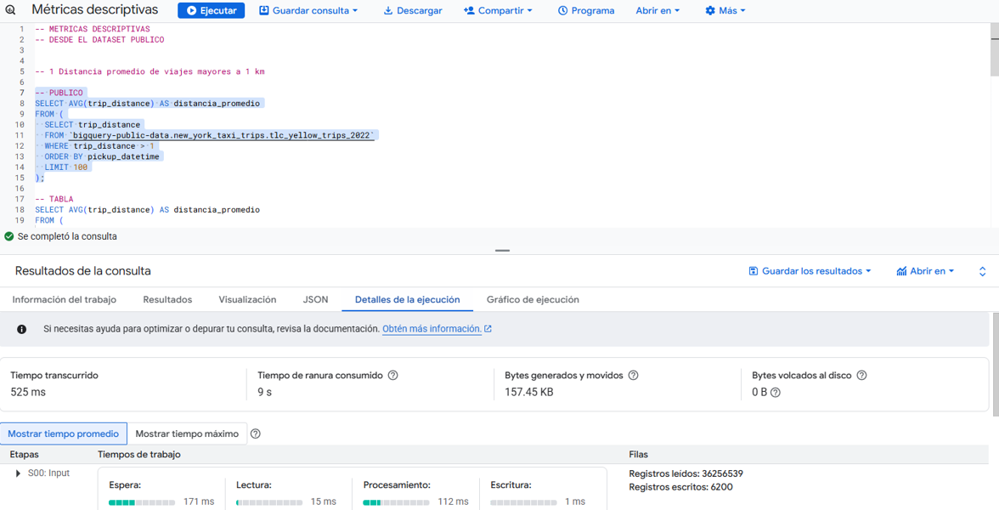

Resultado:

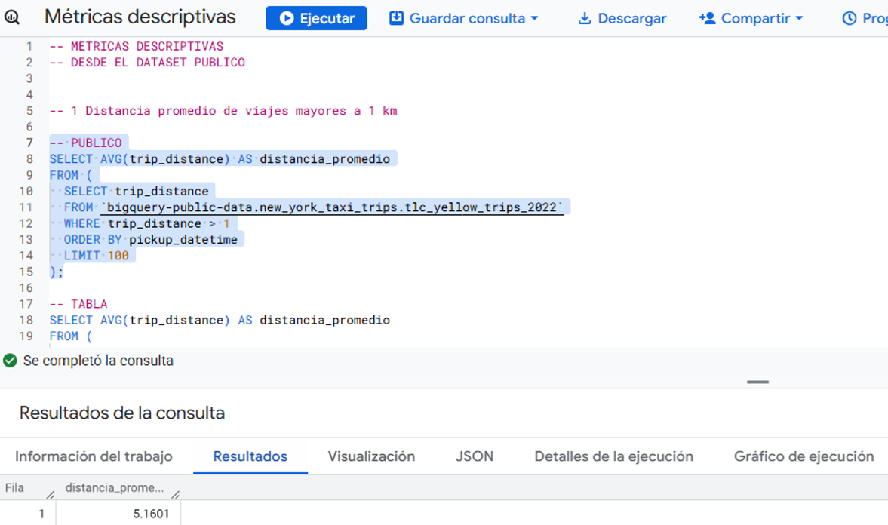


### Distancia promedio de viajes mayores a 1 km (TABLA PARTICIONADA Y CLUSTERIZADA)

Rendimiento:

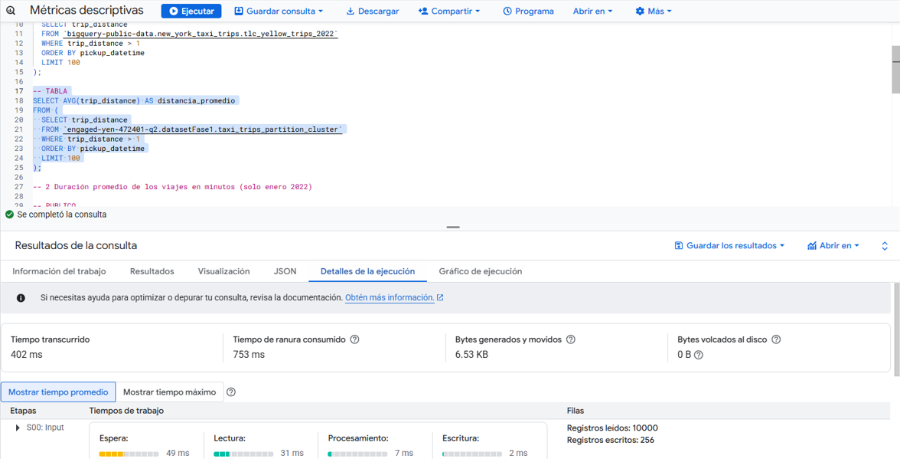

Resultado:

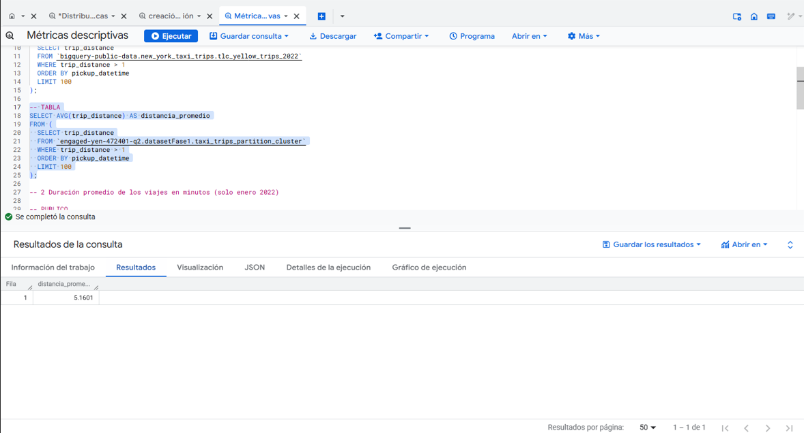


Comparación:
| Métrica                   | Consulta 2 (TABLA) | Consulta 1 (DATASET PUBLICO) |
|---------------------------|--------------------|-------------------------------|
| Tiempo transcurrido       | 402 ms             | 525 ms                        |
| Tiempo de ranura consumido| 753 ms             | 9 s                           |
| Bytes generados y movidos | 6.53 KB            | 157.45 KB                     |
| Bytes volcados al disco   | 0 B                | 0 B                           |
| Registros leídos          | 10,000             | 3,625,659                     |
| Registros escritos        | 256                | 6,200                         |


### Duración promedio de los viajes en minutos (solo enero 2022) (DATASET PUBLICO)

Rendimiento:

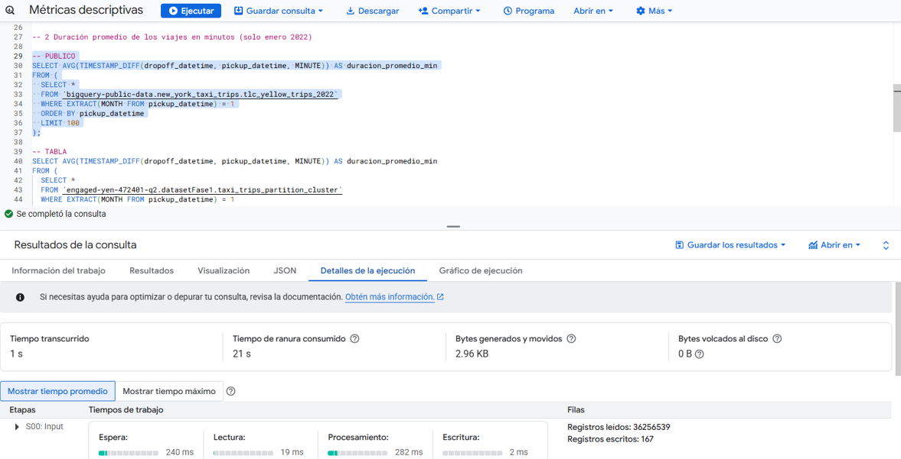

Resultado:

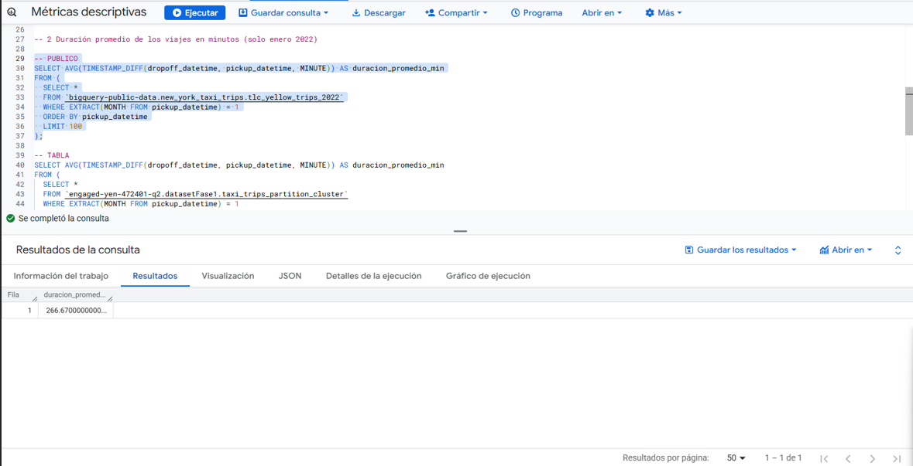

### Duración promedio de los viajes en minutos (solo enero 2022) (TABLA PARTICIONADA Y CLUSTERIZADA)


Rendimiento:

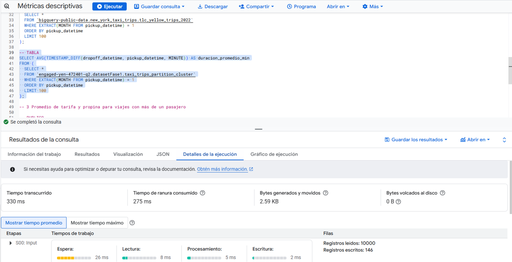

Resultado:

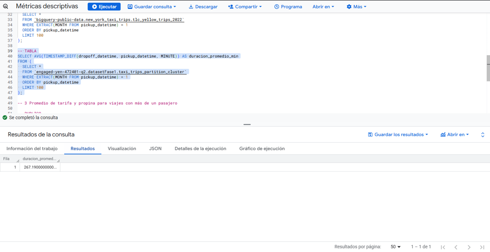

Comparación:

| Métrica                   | Consulta 2 (TABLA) | Consulta 1 (DATASET PUBLICO) |
|---------------------------|--------------------|-------------------------------|
| Tiempo transcurrido       | 330 ms             | 1 s (1,000 ms)                |
| Tiempo de ranura consumido| 275 ms             | 21 s (21,000 ms)              |
| Bytes generados y movidos | 2.59 KB            | 2.96 KB                       |
| Bytes volcados al disco   | 0 B                | 0 B                           |
| Registros leídos          | 10,000             | 3,625,659                     |
| Registros escritos        | 146                | 167                           |


### Promedio de tarifa y propina para viajes con más de un pasajero (DATASET PUBLICO)

Rendimiento:


Resultado:

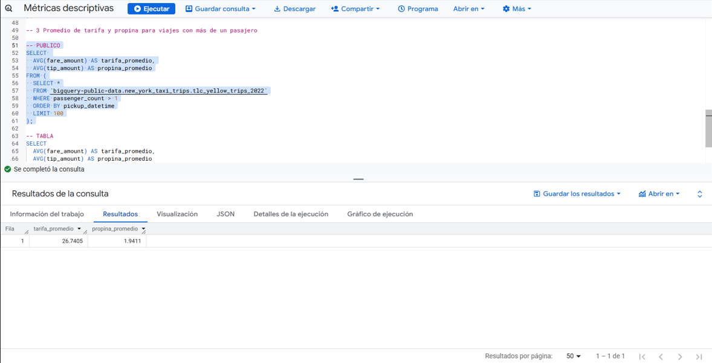

### Promedio de tarifa y propina para viajes con más de un pasajero (TABLA PARTICIONADA Y CLUSTERIZADA)

Rendimiento:

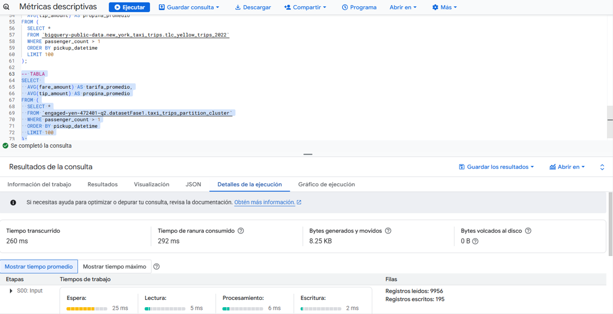

Resultado:

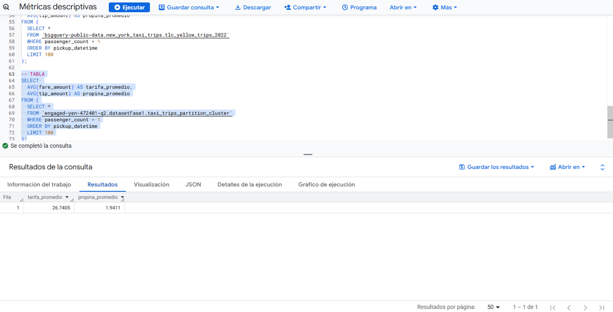

Comparación:
| Métrica                   | Consulta 1 (DATASET PUBLICO) | Consulta 2 (TABLA) |
|---------------------------|-------------------------------|--------------------|
| Tiempo transcurrido       | 586 ms                        | 260 ms             |
| Tiempo de ranura consumido| 6 s                           | 292 ms             |
| Bytes generados y movidos | 260.41 KB                     | 8.25 KB            |
| Bytes volcados al disco   | 0 B                           | 0 B                |
| Registros leídos          | 3,625,659                     | 9,956              |
| Registros escritos        | 6,200                         | 195                |
|

## Distribución de variables categoricas

### Distribución de viajes por método de pago en el primer trimestre 2022 (DATASET PUBLICO)

Rendimiento:

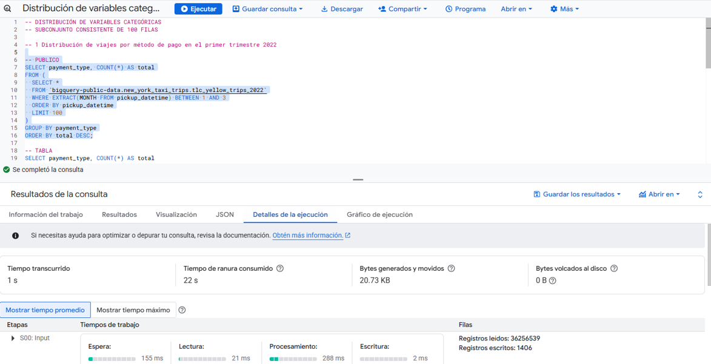

Resultado:

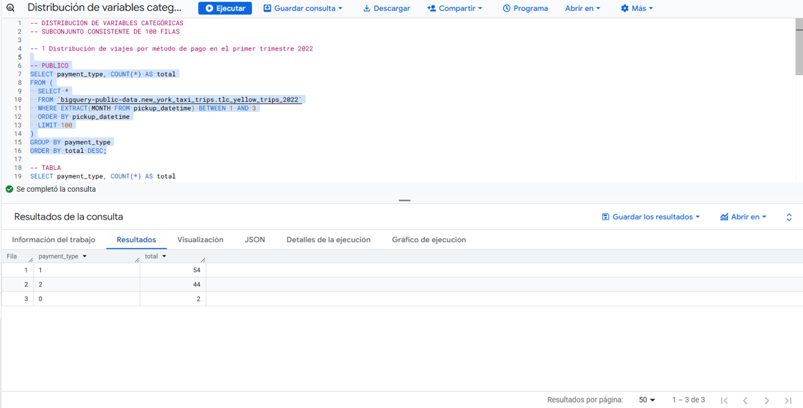

### Distribución de viajes por método de pago en el primer trimestre 2022 (TABLA PARTICIONADA Y CLUSTERIZADA)

Rendimiento:

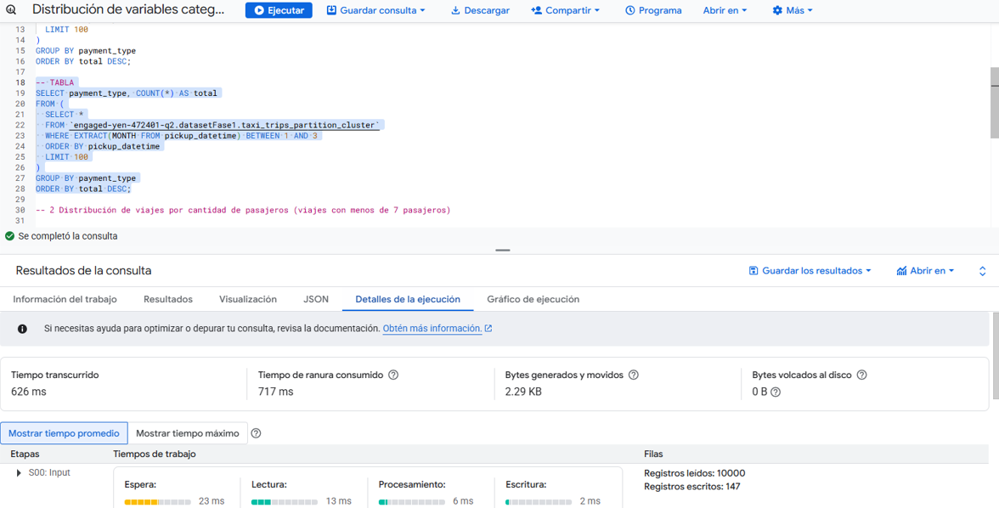

Resultado:

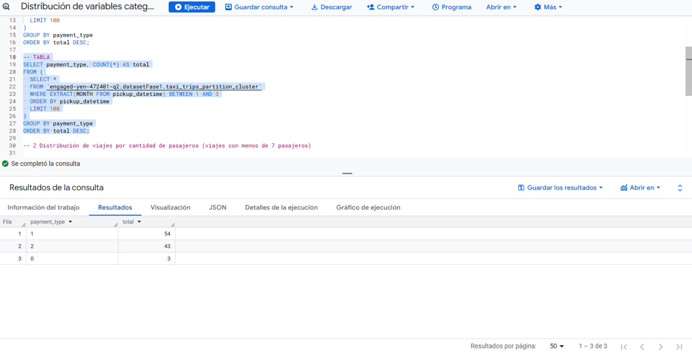

Comparación:
| Métrica                   | Consulta 1 (DATASET PUBLICO) | Consulta 2 (TABLA) |
|---------------------------|-------------------------------|--------------------|
| Tiempo transcurrido       | 1 s (1,000 ms)                | 626 ms             |
| Tiempo de ranura consumido| 22 s (22,000 ms)              | 717 ms             |
| Bytes generados y movidos | 20.73 KB                      | 2.29 KB            |
| Bytes volcados al disco   | 0 B                           | 0 B                |
| Registros leídos          | 3,625,659                     | 10,000             |
| Registros escritos        | 1,404                         | 147                |


### Distribución de viajes por cantidad de pasajeros (viajes con menos de 7 pasajeros) (DATASET PUBLICO)

Rendimiento:

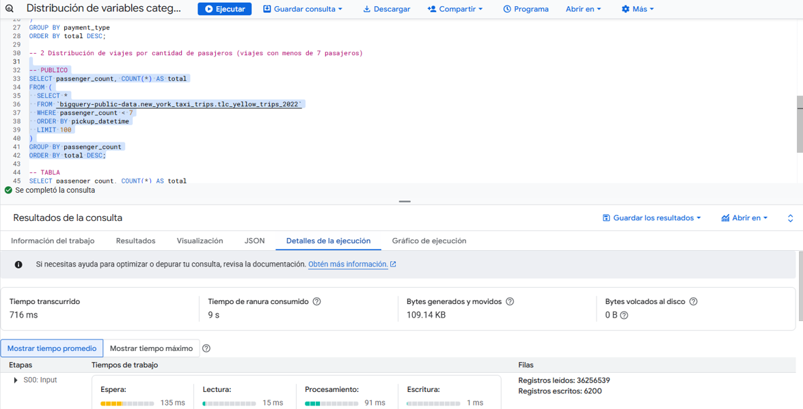

Resultado:

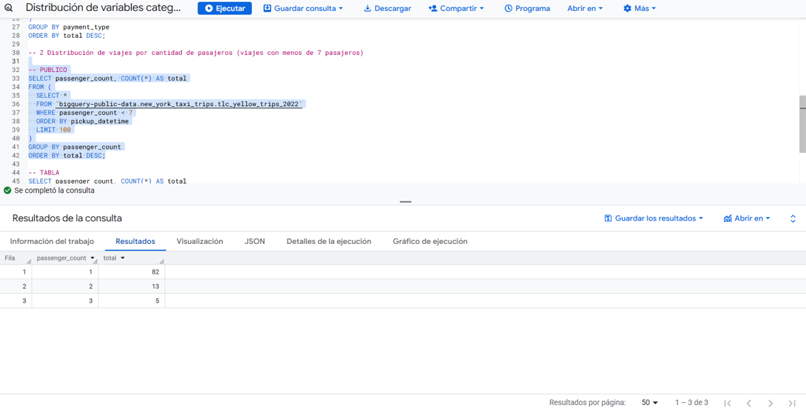

### Distribución de viajes por cantidad de pasajeros (viajes con menos de 7 pasajeros) (TABLA PARTICIONADA Y CLUSTERIZADA)

Rendimiento:


Resultado:

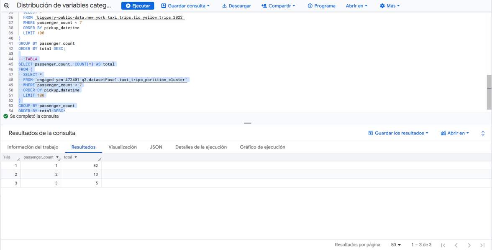

Comparación:
| Métrica                   | Consulta 1 (DATASET PUBLICO) | Consulta 2 (TABLA) |
|---------------------------|-------------------------------|--------------------|
| Tiempo transcurrido       | 716 ms                        | 406 ms             |
| Tiempo de ranura consumido| 9 s                           | 654 ms             |
| Bytes generados y movidos | 109.14 KB                     | 4.92 KB            |
| Bytes volcados al disco   | 0 B                           | 0 B                |
| Registros leídos          | 3,625,659                     | 10,000             |
| Registros escritos        | 6,200                         | 271                |


## Patrones temporales

### Viajes por mes (solo viajes con propina mayor a 0) (DATASET PUBLICO)

Rendimiento:

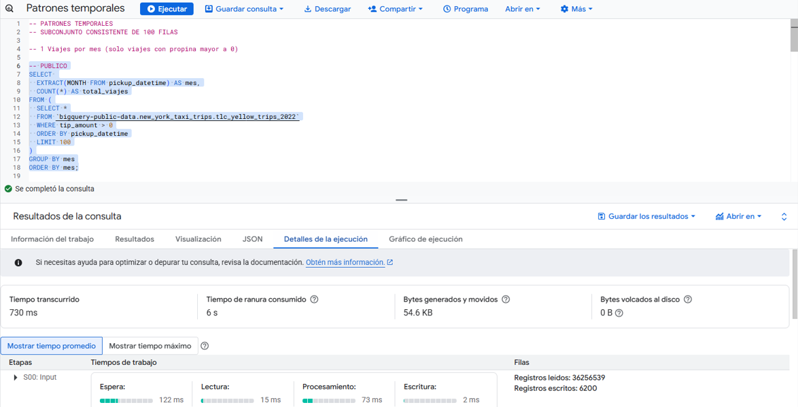

Resultado:

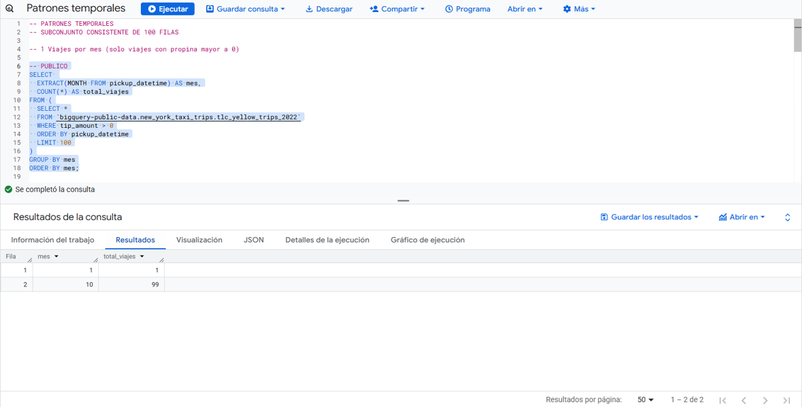

### Viajes por mes (solo viajes con propina mayor a 0) (TABLA PARTICIONADA Y CLUSTERIZADA)

Rendimiento:

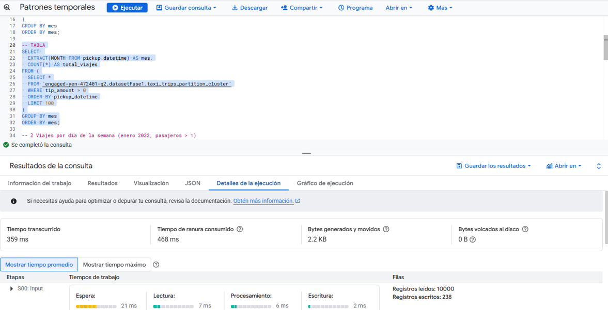

Resultado:

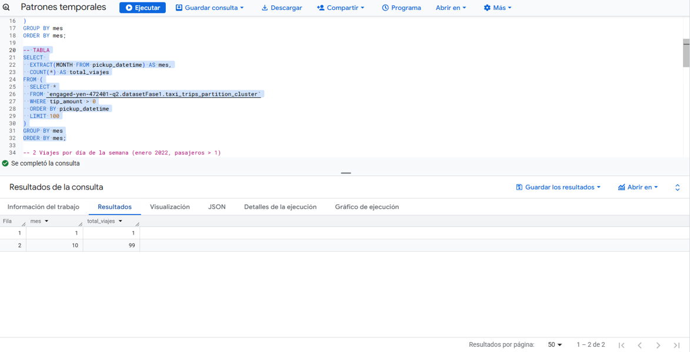

Comparación:
| Métrica                   | Consulta 1 (DATASET PUBLICO) | Consulta 2 (TABLA) |
|---------------------------|-------------------------------|--------------------|
| Tiempo transcurrido       | 730 ms                        | 359 ms             |
| Tiempo de ranura consumido| 6 s                           | 468 ms             |
| Bytes generados y movidos | 54.6 KB                       | 2.2 KB             |
| Bytes volcados al disco   | 0 B                           | 0 B                |
| Registros leídos          | 3,625,659                     | 10,000             |
| Registros escritos        | 6,200                         | 238                |


### Viajes por día de la semana (enero 2022, pasajeros > 1) (DATASET PUBLICO)

Rendimiento:

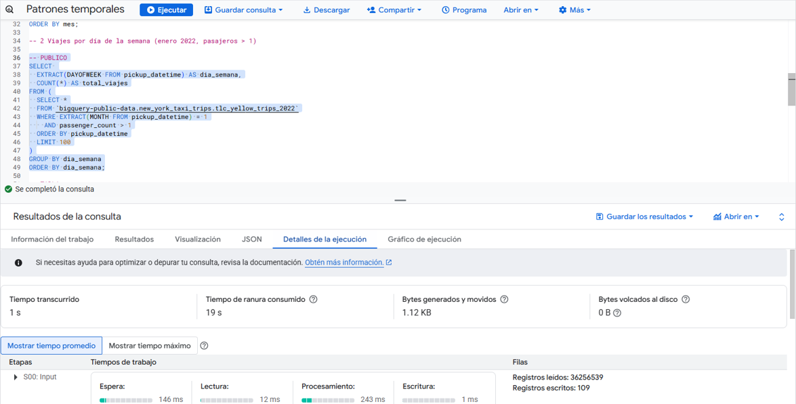

Resultado:

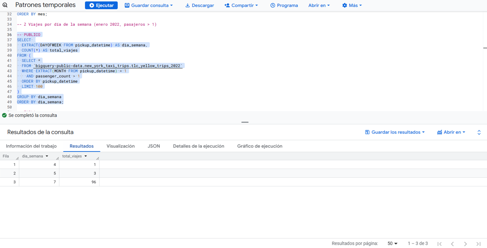

### Viajes por día de la semana (enero 2022, pasajeros > 1) (TABLA PARTICIONADA Y CLUSTERIZADA)

Rendimiento:

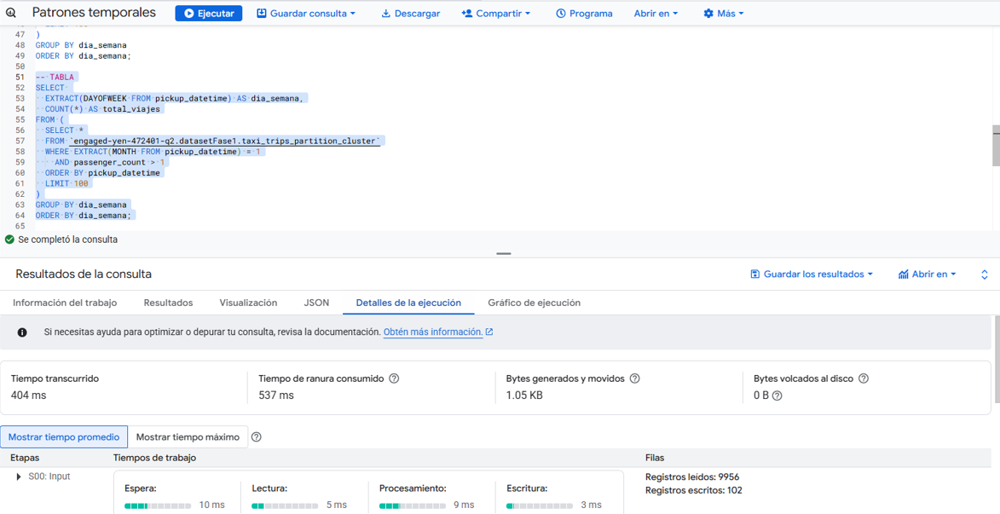

Resultado:

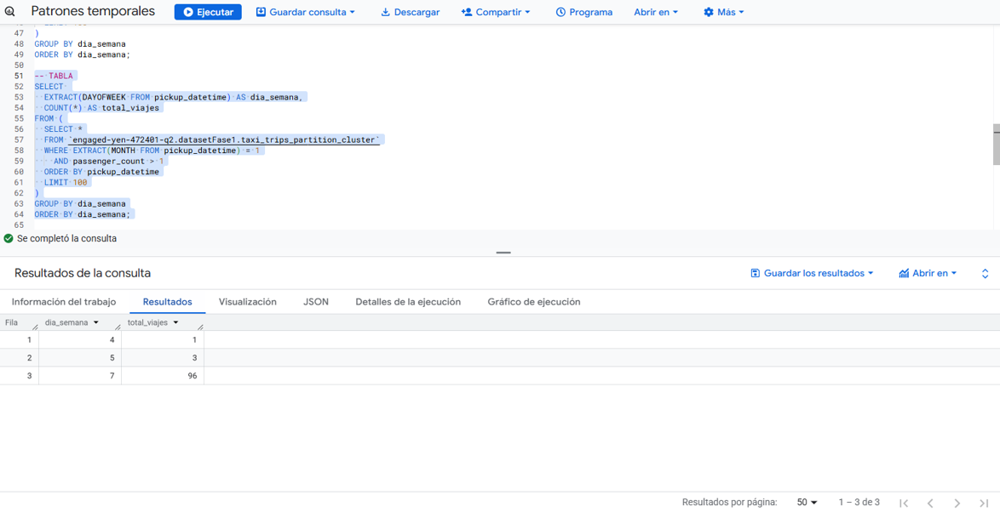

Comparación:

| Métrica                   | Consulta 1 (DATASET PUBLICO) | Consulta 2 (TABLA) |
|---------------------------|-------------------------------|--------------------|
| Tiempo transcurrido       | 1 s (1,000 ms)                | 404 ms             |
| Tiempo de ranura consumido| 19 s (19,000 ms)              | 537 ms             |
| Bytes generados y movidos | 1.12 KB                       | 1.05 KB            |
| Bytes volcados al disco   | 0 B                            | 0 B                |
| Registros leídos          | 3,625,659                     | 9,956              |
| Registros escritos        | 109                            | 102                |


### Viajes por hora del día (solo sábados) (DATASET PUBLICO)

Rendimiento:

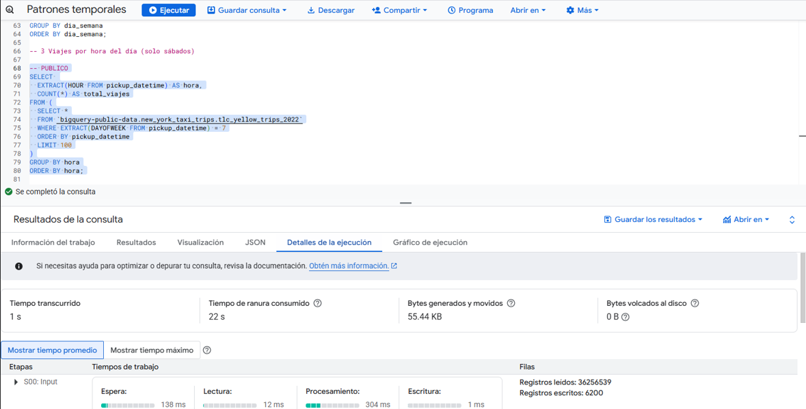

Resultado:


### Viajes por hora del día (solo sábados) (TABLA PARTICIONADA Y CLUSTERIZADA)

Rendimiento:

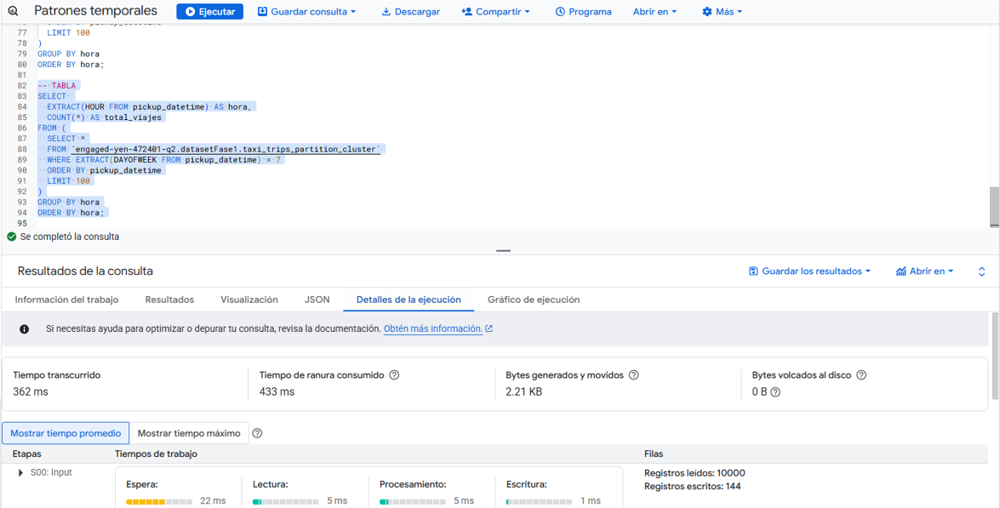

Resultado:

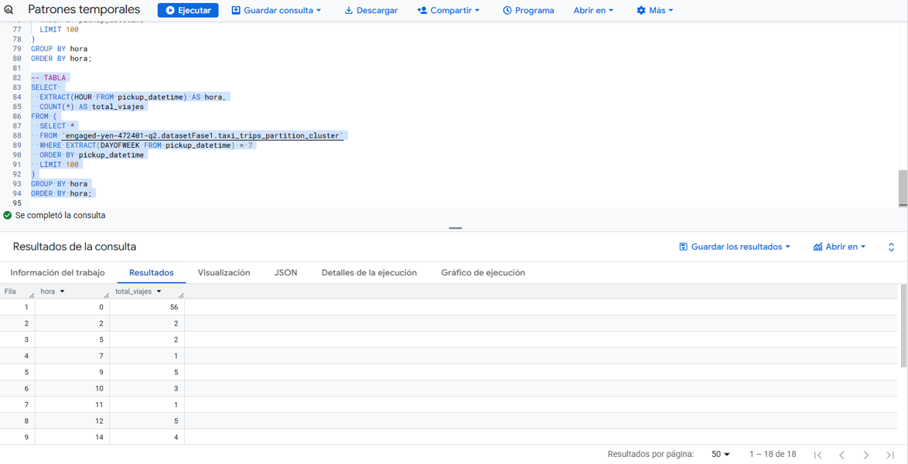

Comparación:
| Métrica                   | Consulta 1 (DATASET PUBLICO) | Consulta 2 (TABLA) |
|---------------------------|-------------------------------|--------------------|
| Tiempo transcurrido       | 1 s (1,000 ms)                | 362 ms             |
| Tiempo de ranura consumido| 22 s (22,000 ms)              | 433 ms             |
| Bytes generados y movidos | 55.44 KB                      | 2.21 KB            |
| Bytes volcados al disco   | 0 B                            | 0 B                |
| Registros leídos          | 3,625,659                     | 10,000             |
| Registros escritos        | 6,200                          | 144                |


## Conclusiones

### Tiempo transcurrido y tiempo de ranura consumido
Las consultas sobre tablas particionadas y clusterizadas presentan un tiempo de ejecución significativamente menor que las mismas consultas sobre el dataset público completo. Mientras que las consultas directas al dataset público pueden tardar hasta varios segundos, las tablas optimizadas se ejecutan en cientos de milisegundos. De manera similar, el tiempo de ranura consumido disminuye drásticamente, reflejando un uso más eficiente de los recursos de procesamiento. Esto evidencia que la optimización mediante particiones y clusterización acelera notablemente las consultas.

### Bytes generados y movidos
Las tablas optimizadas generan y mueven muchos menos bytes que el dataset público completo. Esto se debe a que BigQuery solo lee las particiones y clusters necesarios, evitando escanear toda la tabla. La reducción de bytes movidos contribuye a un menor consumo de recursos y a un procesamiento más ágil, lo que impacta positivamente en la eficiencia general de las consultas.

### Registros leídos y escritos

El número de registros leídos se reduce drásticamente al trabajar con tablas particionadas y clusterizadas. Mientras que las consultas sobre el dataset público leen millones de registros, las tablas optimizadas leen solo los registros necesarios para la consulta. Esto también se refleja en los registros escritos, indicando un menor volumen de datos intermedios y un procesamiento más eficiente.

### Bytes volcados al disco

En ambos casos, los bytes volcados al disco permanecen en cero, lo que muestra que las operaciones se realizan principalmente en memoria y no requieren almacenamiento temporal adicional. Esto confirma que la mejora en rendimiento se debe principalmente a la reducción de datos leídos y no a diferencias en la escritura.

### Conclusión general

En conjunto, las métricas demuestran que las tablas particionadas y clusterizadas optimizan significativamente el rendimiento de las consultas en BigQuery. Reducen el tiempo de ejecución, el consumo de recursos y la cantidad de datos procesados, lo que permite un análisis más rápido y eficiente, especialmente en datasets de gran tamaño. Por lo tanto, la partición y clusterización son estrategias recomendadas para mejorar la eficiencia de consultas en entornos de grandes volúmenes de datos.


